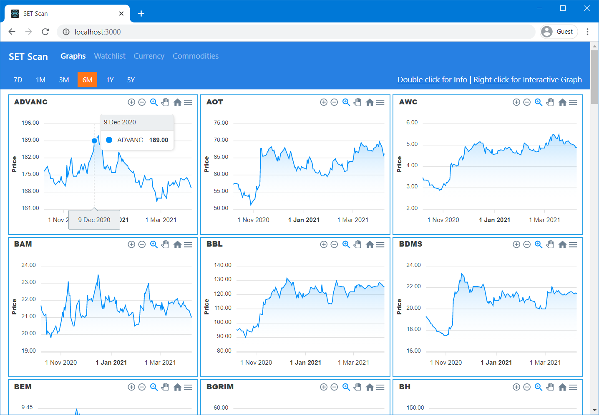

# SET Scan

**SET Scan** is a web application that helps you find stocks in The Stock Exchange of Thailand for investment based on historical graphs.



## Installation

First, please make sure you have npm installed on your machine.
Next, clone this repository, then run `npm install`.

```bash
git clone https://github.com/tithanayut/SET-scan.git
cd SET-scan
npm install
```

After that, open `API.js` located in `/src/Graphs/Graph/` to add your own CORS proxy and Yahoo Finance URI.

```js
const CORS_PROXY = "";
const API_PATH = "";
```

Then run

```bash
npm start
```

## Usage

-   Follow the instruction above to deploy SET Scan.
-   Open the site using your web browser.
-   Add some stocks to your watchlist using the Watchlist page. You may click on SET50 or SET100 button to replace your current watchlist with the stocks in the SET50 or SET100 index.
-   Open Graphs page. If your CORS proxy and API URI are correct, you should see the graphs right away.
-   For currency (USD-to-THB) and commodities (Crude oil/Gold), the graph should load right away. The data and graphs of both are provided via TradingView.

## License

MIT
